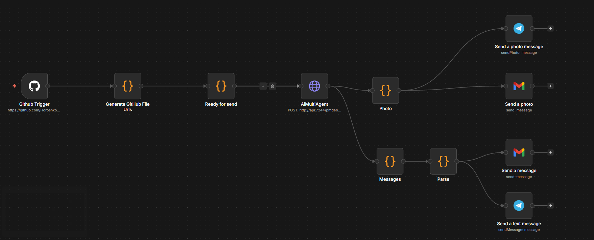
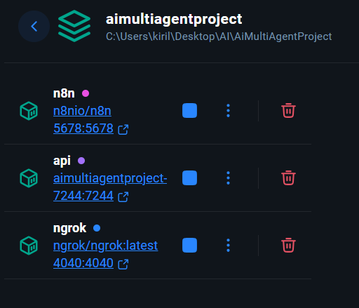

# AiMultiAgentProject

Многоагентная интеллектуальная система, которая помогает команде разработчиков вести проект:

- планирует задачи,
- анализирует код и коммиты,
- проверяет тесты,
- генерирует документацию,
- оформляет визуальные артефакты (диаграммы, UI-макеты).

Система основана на **n8n** и использует **MCP** для общения агентов (тулов/инструментов) друг с другом. 
Вся система развернута и запускается с использованием **Docker Compose**.
Это позволяет быстро развернуть проект без ручной настройки зависимостей.

## Описание работы 

- Разработчик пушит код в **GitHub**.
- **n8n** фиксирует событие и отправляет MCP-сообщение **Project Manager Agent**
- **Project Manager Agent** анализирует полученный JSON и составляет план работы двух других агентов (**Code Reviewer Agent** и **Documentation Agent**)
- **Code Reviewer Agent** анализирует код исходя из названия файла и его содержимого и отправляет JSON с найдеными проблемами PM агенту.
- **Documentation Agent** анализирует входные файлы и содержимое коммита и составляет uml диагармму и описание в markdown 
- Итог отправляется в Telegram и Gmail

## Описание агентов 

Находится в папке **docs/** подробное описание всех агентов в отдельных .md файлах

## Описание n8n workflow

### Ngrok

Сразу необходимо запустить ngork, что бы тунелировать запросы к n8n

```bash
ngrok http 5678
```

Запускать лучше через docker, описано позже.

### Запуск n8n 

Запускать лучше через docker, после того как будут заданы все env, будет описано позже.

### Workflow picture



### Github Trigger

Для его настроики необходимо зайти в github account написать свой **user** и свой **Access Token**
Далее указать автора репозитория и имя репозитория (By URL)
События (Events) выбрать push

### Generate Github File Urls

Блок для скачивания файлов из github 

Это JS блок кода

**Mode : Run Once for All Items** 

```js
if (!$json.body || !$json.body.repository || !$json.body.after || !$json.body.head_commit) {
  return [];
}

const repo = $json.body.repository.full_name;
const sha = $json.body.after;
const files = [
  ...($json.body.head_commit.added || []),
  ...($json.body.head_commit.modified || [])
];

const fileResults = await Promise.all(
  files.map(async file => {
    const url = `https://raw.githubusercontent.com/${repo}/${sha}/${file}`;

    const content = await this.helpers.request({
      method: 'GET',
      url,
      json: false, 
    });

    return {
      fileName: file,
      data: content
    };
  })
);

return [
  {
    json: {
      body: $json.body,
      headers: $json.headers,
      query: $json.query,
      files: fileResults
    }
  }
];

```
### Ready for send

Это блок js кода для формирования правильного json для отправки на сервер агентов

**Mode : Run Once for All Items** 

```js
const input = $input.all();


const bodyBlock = input.find(i => i.json.body);
const filesBlock = input.find(i => i.json.files);

const files = filesBlock.json.files;

const componentDescription =
  bodyBlock.json.body.head_commit?.message || "";


return [
  {
    json: {
      files,
      componentName: "",
      componentDescription
    }
  }
];

```

### AIMultiAgent

Это блок http запроса на сервер агентов для обработки json с информацией о push 

**Method : POST**

**URL : http://api:7244/pmdebug/mcp/report** - зависит от настроек docker, если не менять порты, то все будет работать в данной конфигурации. 

**Authntication : None**

**Send Body : On**

**Body Content Type : JSON**

**JSON : {{$json}}**

**Ignore SSL Issues (Insecure) : On**

### Photo

Это блок js кода для преобразования imgBase64 в картинку

```js
const imgBase64 = $json.ToolResults?.generate_docs?.result?.umlPlantUmlImageBase64;
const photoMessages = [];
if (imgBase64) {
  photoMessages.push({
    json: { text: "UML Diagram" }, 
    binary: {
      photo: {
        data: Buffer.from(imgBase64, "base64"),
        fileName: "diagram.png",
        mimeType: "image/png",
      },
    },
  });
}

return photoMessages;
```

### Messages

Это блок js кода для разделения большого сообщения на части (Ограничения Tg и Gmail)

```js
const report = $json;


let text = JSON.stringify(report, null, 2);


const chunkSize = 4000;
let messages = [];

for (let i = 0; i < text.length; i += chunkSize) {
  messages.push({
    json: { text: text.slice(i, i + chunkSize) }
  });
}


const imgBase64 = report.ToolResults?.generate_docs?.result?.umlPlantUmlImageBase64;
if (imgBase64) {
  messages.push({
    json: { text: "UML Diagram" }, 
    binary: {
      photo: {
        data: Buffer.from(imgBase64, "base64"),
        fileName: "diagram.png",
        mimeType: "image/png",
      },
    },
  });
}

return messages;
```

### Parse

Это блок js кода для экранирования символов, что бы их хорошо обрабатывал HTML, в котором сообщения отправляются в Tg и Gmail

```js

return $items().map(item => {
    const text = item.json["text"] || item.json["message"] || "";

    function escapeHtml(html) {
        return html
            .replace(/&/g, "&amp;")
            .replace(/</g, "&lt;")
            .replace(/>/g, "&gt;")
            .replace(/"/g, "&quot;")
            .replace(/'/g, "&#39;");
    }

    return {
        json: {
            text: escapeHtml(text)
        }
    };
});
```

### Telegram

Для **Send a photo** и **Send a text** необходимо создать бота через @BotFather и назначить его администратором в группе. Получить **Access Token** и установить соединение с ботом в n8n

Узнать chatID группы с помощью команды 
```bash
curl https://api.telegram.org/bot<YOUR_BOT_TOKEN>/getUpdates
```

Что бы команда сработала необходимо, чтобы в группе были какие-нибудь сообщения. 

### Gmail 

Через **Google Cloude Console** создаем проект и получаем **Client Id** и **Сlient Secret** указываем в **OAuth Redirect Url** Url, который предлагает n8n.  
Входим в google accounte и выставляем все необходимые разрешения. 

Добавляем gmail, кому хотим отправить результат

Точно также и с фото, только у фото нужно добавить 

**Attachment Field Name : photo**

## Docker

### .env

Перед запуском docker необходимо настроить все переменные окружения.
Описание предоставлено в файле .env.example

Все что начинается с N8N чаще всего требует url, которые выдает ngork, это поможет направлять внешние запросы на ngrok, а позже на n8n, который работает локально.

### Запуск docker conatainer

Выполним команду 

```bash
docker compose up --builde
```

В дальнейшем можно без **--builde**

Это соберет и поднимет docker многоконтейнерное приложение и запустить проект, n8n и ngrok. 

Следующая команда остановит контейнер, если он больше не нужен

```bash
docker compose down
```

Рабочее состояние: 



